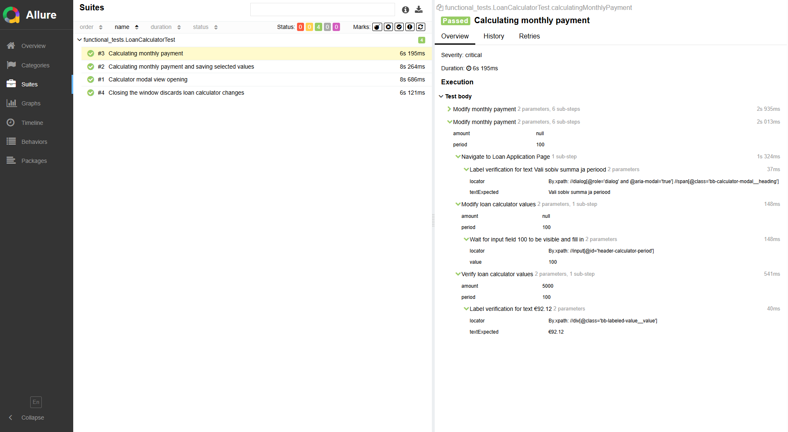

## Loan calculator UI Automation Info

---
This project is a UI automation test suite for a loan calculator application. It is designed to validate the functionality of 
the loan calculator by performing various calculations and ensuring that the results are accurate. The tests are written
in Java using Selenium WebDriver and TestNG, and the results are reported using Allure.

- [Technologies](#technologies)
- [Installation](#installation)
- [Reports](#reports)
- [Framework description](#-framework-description)

---
### 📦 Technologies:
- Selenium WebDriver
- Java
- Maven
- Allure report
- TestNG

---

### 📦 Installation
Chromedriver can be installed automatically within project, if it does not happen you can install it manually.

- Download ChromeDriver to directory (to be compatible with your browser):
```
	C:\Program Files\WebDriver\chromedriver.exe
```

- Clone this repository to your local machine using the command below:
```
	$ git clone https://github.com/tbogdel/testexercise_bank2.git
```

### 📦 Reports

* To view report of test, access the files from: */target/allure-results*

```
	$ mvn allure:serve
```

Note: if your browser can not open report then replace generated address by localhost

<details>
<summary>📌 Example</summary>
```
    
```
</details>

### 📦 Framework description
The framework is designed to be modular and easy to extend. It includes the following components:
- **BasePage**: Contains common methods and elements that are used across multiple pages.
- **LoanCalculatorPage**: Contains methods specific to the loan calculator page, such as entering loan amount, interest rate, and term, and calculating the monthly payment.
- **TestBase**: Contains setup and teardown methods for the tests, including WebDriver initialization and Allure reporting.
- **LoanCalculatorTest**: Contains the actual test cases that validate the functionality of the loan calculator.
- **WebDriverManager**: Manages the WebDriver instance and provides methods for initializing and quitting the driver.
- **Locators**: Locators are defined within the same class that represents the behavior of a particular page (Page Object).

#### 💡 Why this structure?

- **Easy to read and debug** — anyone can understand what’s happening, even without IDE hints
- **Scalable** — new tests follow the same pattern, making the framework easy to extend
- **Self-documenting** — method names and `@Step` annotations explain the logic without extra comments
- **Traceable** — Allure reports show exactly what actions were taken, in what order, and where a failure occurred


